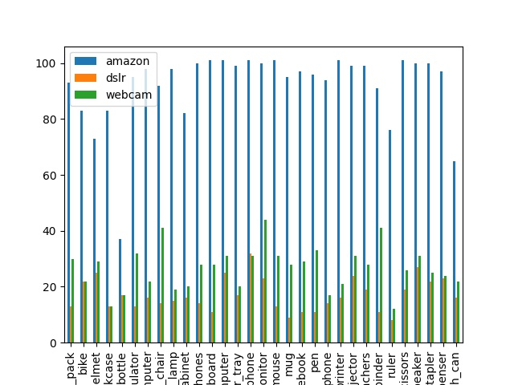

# Unsupervised Domain Adaptation Utilizing CycleGAN

This repository contains code for the following tasks:  
1) Reproducing CycleGAN paper's results
2) Implementing CycleGAN Office-31 dataset
3) Training Resnet-18 on Office-31 dataset  
4) Plotting TSNE to show domain-shift 

## Dataset

The Office dataset contains 31 object categories in three domains: Amazon, DSLR and Webcam. The 31 categories in the dataset consist of objects commonly encountered in office settings, such as bicycles, monitors, and calculators (see fig.). The Amazon domain contains on average 90 images per class and 2817 images in total. As these images were captured from a website of online merchants, they are captured against clean background and at a unified scale. The DSLR domain contains 498 low-noise high resolution images (4288×2848). There are 5 objects per category. Each object was captured from different viewpoints on average 3 times. For Webcam, the 795 images of low resolution (640×480) exhibit significant noise and color as well as white artifacts.

- Office dataset homepage: https://www.cc.gatech.edu/~judy/domainadapt/           
- Office-31 dataset download link: https://drive.google.com/file/d/0B4IapRTv9pJ1WGZVd1VDMmhwdlE/view?resourcekey=0-gNMHVtZfRAyO_t2_WrOunA

## Running Experiments

1) Setting up the environment
- `pip install -r requirements.txt` for installing all the required libraries to run this project
- `bash cyclegan_dataset_download.sh` to download all the required datasets for reproducing CycleGAN's results
- `python office31_data_split.py` to download Office-31 dataset and split it for the CycleGAN experiment and Domain Adaptation experiment.

2) Reproducing CycleGAN paper's results   
After downloading the datasets, set `dataset_name` for the dataset you eant to train CycleGAN model on.  
Training the CycleGAN model:
- `python train.py --dataroot ./datasets/{dataset_name} --name {experiment_name} --model cycle_gan`   

    Testing:   
- `python test.py --dataroot ./datasets/{dataset_name} --name {experiment_name} --model cycle_gan`

3) Implementing CycleGAN Office-31 dataset
After downloading Office-31 dataset and restructuring it for the training, run
- `bash train_bash.py` to convert Office-31 domains in set A and set B (that's how CycleGAN datasets are specifeid) and to train it
4) Training Resnet-18 on Office-31 dataset  
- `python train_office.py` for training and saving the model weights
5) Plotting TSNE to show domain-shift 
- `python extract_features.py` to extract the Office-31 features and save it in the `npy` format.
- `python plot_tsne.py` to plot TSNE graph of features to show the domain-shift

