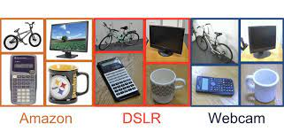

# Unsupervised Domain Adaptation Utilizing CycleGAN

This repository contains code for the following tasks:  
1) Reproducing CycleGAN paper's results
2) Implementing CycleGAN Office-31 dataset
3) Training Resnet-18 on Office-31 dataset  
4) Plotting TSNE to show domain-shift 

## Dataset

The Office dataset contains 31 object categories in three domains: Amazon, DSLR and Webcam. The 31 categories in the dataset consist of objects commonly encountered in office settings, such as bicycles, monitors, and calculators (see fig.). The Amazon domain contains on average 90 images per class and 2817 images in total. As these images were captured from a website of online merchants, they are captured against clean background and at a unified scale. The DSLR domain contains 498 low-noise high resolution images (4288×2848). There are 5 objects per category. Each object was captured from different viewpoints on average 3 times. For Webcam, the 795 images of low resolution (640×480) exhibit significant noise and color as well as white artifacts.

- Office dataset homepage: https://www.cc.gatech.edu/~judy/domainadapt/           
- Office-31 dataset download link: https://drive.google.com/file/d/0B4IapRTv9pJ1WGZVd1VDMmhwdlE/view?resourcekey=0-gNMHVtZfRAyO_t2_WrOunA

## Running Experiments
